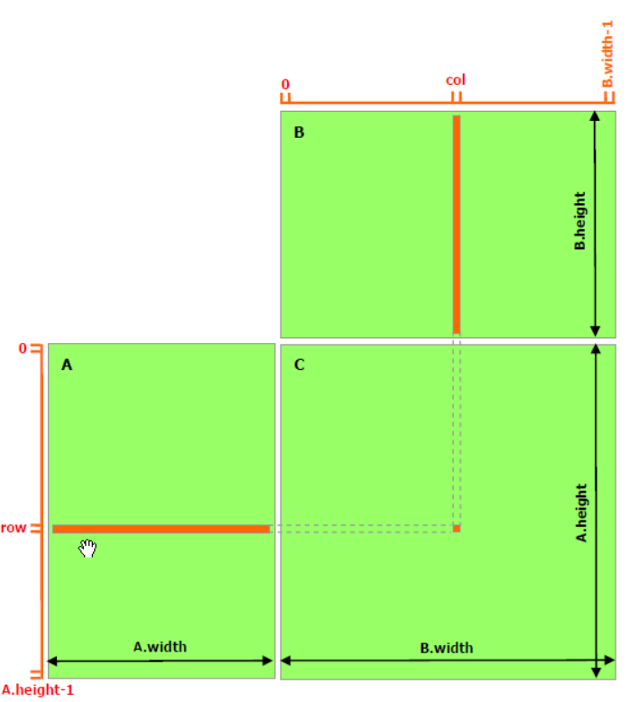

# This is just reimplement MIT course parallel-computing-tutorial

Referece : <https://github.com/mit-han-lab/parallel-computing-tutorial>

| Method                | Time (ms) |
|-----------------------|-----------|
| naive_mat_mul         | 3617      |
| mat_mul_reordering    | 2220      |
| mat_mul_tiling        | 2277      |
| mat_mul_cuda          | 669       |
| mat_mul_cuda_shared   | 15        |

# 21/10/2024 add reference

<https://siboehm.com/articles/22/CUDA-MMM>
<https://leimao.github.io/article/CUDA-Matrix-Multiplication-Optimization/>
